# 프로젝트명: Seven Deadly Sins

# [컨셉]

## 메인컨셉 : 모험

현대 사타니즘에서는 7대 죄악을 교만(오만), 인색(탐욕), 시기(질투), 분노, 음욕(색욕), 탐욕(식탐), 나태로 구분하고 있습니다. 각 죄목에 해당하는 상징 악마와 동물이 있듯이 플레이어는 세상이 죄악에 물드는 것에 반하여 각 악마들이 존재하는 각기 다른 환경에서 모험하며 그들을 물리치는 컨셉입니다.

플레이어는 위와 같은 세계관에서 모험을 하여 흥미진진한 스토리를 경험할 것입니다. 미지의 장소를 탐색하는 행위 혹은 어떤 목적달성을 위해서 위험을 무릅쓰고 모험하는 것은 게임의 재미 요소로써 작용할 수 있기 때문에 모험이라는 컨셉을 메인 컨셉으로 선택했습니다. 적절한 배경 레벨 디자인을 통해 다양한 곳을 가보고 싶거나 새로운 것을 발견하고 싶은 욕구를 불러일으킬 수 있기 때문에 모험이라는 요소를 메인 컨셉으로 제작하려는 해당 게임은 유저에게 재미있는 경험을 부여할 수 있을 것입니다. 

### 서브 컨셉 1 : 전투

플레이어는 난이도가 높은 소울류 게임처럼 몬스터의 공격을 회피기로 피할 수 있고, 적절한 공격 타이밍에 공격을 취하면서 본인의 피해를 최소화 시켜야 전투에서 유리한 상황을 취할 수 있습니다. 각 몬스터는 다양한 공격 패턴이 있기 때문에 다양한 방식으로 전투가 이루어질 수 있습니다.

아마 플레이어에게 전투는 가장 주된 서브 컨셉 중 하나이지만 가장 어려운 요소로 자리매김 할 것입니다. 플레이어는 전투의 3가지 구성 요소인 공격, 방어, 회피를 적절히 이용하여 몬스터와 전투를 진행하지만 몬스터 또한 여러 종류라면 각기 다른 패턴으로 위 3가지 전투 요소를 수행할 것입니다. 여기서 플레이어는 상대 몬스터와의 전투에서 박진감 넘치고 재미있는전투를 진행할 수 있을 것입니다. 그리고 보스 몬스터는 더 다양한 공격과 이동 등을 진행할 수 있기 때문에 공략하는 과정에서도 재미를 느낄 수 있을 것입니다.

### 서브 컨셉 2 : 세계관 및 스토리

칠죄종을 바탕으로 이루어진 세계관이며 각 특징이 존재하는 배경에서 모험을 진행합니다. 각 죄목에 대한 시나리오를 완료(극복)하면서 흥미진진한 서사를 감상할 수 있습니다.

세계관 및 스토리에서 유저가 재미를 느끼기 위해 현대인들을 나타내기도 한 7대 죄악이라는 대표적인 세계관을 도입했습니다. 제작하는 과정에서 몇 가지의 죄를 우선적으로 선정할 것이고, 이를 게임 배경 제작과 레벨 디자인을 진행할 것입니다. 7가지의 죄 요소가 각각 다른 배경에서 스토리가 진행되어 플레이어는 다양한 배경 요소에서 모험과 전투 를 진행할 수 있다는 장점이 있고 이는 재미 요소로 나타날 수 있습니다.

### 서브 컨셉 3 : 상징

각기 다른 환경에서 죄목마다 어떤 점으로 상징이 되는지는 주목해야할 요소입니다. 예를 들면 분노라는 죄목을 주제로 플레이어가 지옥 배경을 모험 할 수도 있는 것처럼 각 죄목과 배경의 상징적인 조화는 흥미로운 요소입니다.

그래서 적절한 배경 컨셉과 레벨 디자인이 플레이어에게 더 몰입감있고 재미있는 요소로써 작용될 수 있습니다.

### 서브 컨셉 4 : 몰입감

높은 수준의 그래픽 퀄리티로 사용자에게 몰입감과, 신화적인 컨셉의 작용 등으로 긴장감을 줄 수 있습니다. 그리고 높은 난이도의 전투 방식으로 플레이어의 집중과 몰입을 이끌어낼 수 있습니다.

플레이어가 현재 플레이하고 있는 동안에도 흥미로운 세계관과 감상할 수 있는 배경, 그 안에서 벌어지는 전투 요소들이 플레이어의 몰입감을 높일 것이며, 메인 컨셉인 모험 요소가 플레이어의 다음 행동이나 플레이 방향 설정에 도움을 줄 수 있기 때문에 유저 스스로 게임 내 다음 활동을 염두에 두고 플레이하면서 자연스럽게 집중과 몰입을 이끌어낼 수 있습니다.

### 서브 컨셉 5 : 사운드 & 이펙트 & AI

적절한 사운드와 이펙트 효과를 통해 게임에 풍미를 더해줍니다, 그리고 AI 몬스터들이 플레이어를 적대시하며 공격하게 됩니다. 이는 적절한 AI 학습을 통해 전투에서 플레이어에게 조금 더 다양한 플레이를 제공합니다.

사운드는 무료 사운드 사이트를 이용해서 적절한 사운드를 적용할 계획입니다. 기본적으로 달리기 소리나 공격 소리, 피격음과 사망음, 배경음 등이 사용될 것이고, 이펙트는 Epic game Launcher에서 다운로드 받은 이펙트, 또는 추가로 탐색해서 공격과 방어, 회피할 때의 전투나 기타 환경 요소에 적절히 적용해서 플레이의 재미를 더할 것입니다.

AI 요소는 몬스터 기능에 필요한 요소인데, 적절한 학습을 통해 공격, 방어, 회피, 이동 등을 구현할 것입니다. 보스 몬스터의 경우 조금 더 다양한 공격과 이동 패턴을 추가하여 다른 몬스터와 다르게 더 강하다는 느낌을 부여할 것입니다.

  

# [관련 이미지 & 동영상]

- 이미지

  
- 동영상
<a href="https://www.youtube.com/watch?v=PN7YFKHOR9Y">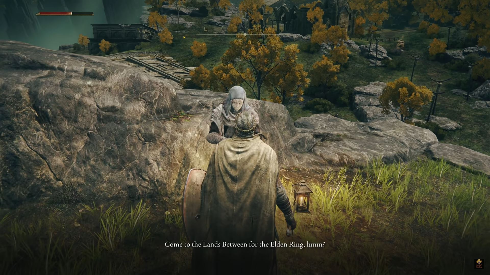</a>

  

# [대표 이미지]
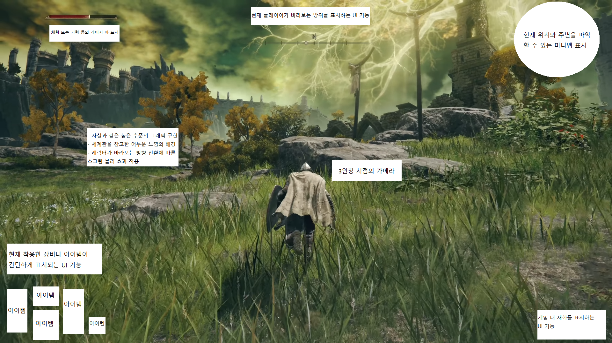

  

# [컨셉 & 대표이미지 기반 작품묘사]

> ### 대표이미지 기반 : UI 및 화면 구성

좌측 상단 : 플레이어의 체력 또는 기력 등의 게이지바가 표시되어 현재 상태를 확인할 수 있는 UI 표시

중앙 상단 : 현재 플레이어가 바라보는 방위를 표시하는 UI 표시

우측 상단 : 현재 위치와 주변을 파악할 수 있는 미니맵 표시

좌측 하단 : 현재 착용한 장비나 아이템이 간단하게 표시되는 UI 표시

우측 하단 : 게임 내 재화를 표시하는 UI 기능

> ### 컨셉 기반: 배경 및 요소

1. 사실과 같은 높은 수준의 그래픽 구현

2. 세계관을 참고한 어두운 느낌의 배경 구현

3. 캐릭터가 바라보는 방향 전환에 따른 스크린 블러 효과 적용

4. 3인칭 시점의 카메라 적용

  

# [<Seven Deadly Sins> 구성 요소]

- 현대 사타니즘에서 정의한 7대 죄악을 배경으로 한 세계에서 모험과 전투를 하는 RPG 게임

 

## 1. 메커니즘

[도전 과제]

- 플레이어는 현재 상태를 잘 파악하여 체력 게이지 바가 다 닳아 게임 오버가 되지 않도록 해야한다.

- 전투나 퀘스트를 통해 얻은 게임 내 재화를 이용하여 캐릭터를 성장시켜야 한다.

- 플레이어는 준비된 스토리에 따라 모험하며 최종 보스 몬스터와의 전투에서 승리하여 게임을 클리어한다.

[재미 요소]

- 몬스터의 공격을 회피기로 피할 수 있고, 적절한 공격 타이밍에 공격을 취하면서 본인의 피해를 최소화 시켜야 전투에서 유리한 상황을 취할 수 있다.

- 각 몬스터는 다양한 공격 패턴이 있기 때문에 다양한 방식으로 전투가 이루어질 수 있다.

- 칠죄종을 바탕으로 이루어진 세계관이며 각 특징이 존재하는 배경에서 모험을 진행합니다. 각 죄목에 대한 시나리오 진행을 완료하면서 흥미진진한 서사를 감상할 수 있다.

- 다양한 배경 요소에서 모험과 전투를 진행할 수 있다.

- 높은 수준의 그래픽 퀄리티로 사용자에게 몰입감과, 신화적인 컨셉의 작용 등으로 긴장감과 재미를 줄 수 있다.

- 어려운 난이도의 전투 방식으로 플레이어의 집중과 몰입을 이끌어낼 수 있다.

 

## 2. 이야기

[만들게 된 배경]  
배경 그래픽 디자이너를 희망하기 때문에 그래픽적으로 높은 수준의 작업물들을 이용하여 자유롭고 광활한 오픈 월드를 만들고 싶었습니다. 이러한 배경 요소가 적절히 어울릴만한 게임을 고민하던 중 다크소울류 게임이 가장 먼저 생각이 났고, 다른 한편으로 세계관 설정이나 시나리오 제작 또한 좋아하는 편입니다. 이를 게임 내에서 신화를 접목한 이야기로써 풀고 싶은 마음에 모험 요소가 포함된 RPG 게임을 만들게 되었습니다.

[카메라 관점]  
카메라는 3D 환경에서 3인칭으로 적용됩니다. 플레이어의 캐릭터와 상대 몬스터와의 전투에서 각 움직임(공격이나 회피)을 상황에 맞게 적절히 수행해야 하며 타이밍적 요소를 넣을 것이기 때문에 이를 위해 3인칭 카메라로 적용한다면 적절할 것이라고 생각했습니다. 그리고 7대 죄악을 배경으로 한 환경에서 플레이를 할 때 영화같은 느낌을 주고싶은 이유도 있습니다.

 

## 3. 미적요소

[디자인][컬러]  
배경 관련된 모든 요소는 직접 제작할 예정입니다. 7대 죄악에 맞는 배경을 미리 선정해놓았고, 해당 테마에 맞는 여러 배경 요소들을 제작하여 게임에 적용할 것인데, 이는 배경 그래픽 디자이너를 희망하는 점을 강조하는 부분이 될 것입니다. 각 오브젝트는 최대한 퀄리티를 높여서 전체적으로 실사풍의 그래픽을 구현할 것이고, 언리얼 엔진 5의 루멘 라이팅 등 최신 기술을 적용함으로써 미적 퍼포먼스를 최대한으로 끌어낼 것입니다. 특히 엔진의 포스트 프로세싱을 통한 라이팅 또한 진행할 것입니다.

[음향]  
무료 음원 사이트를 참고하여 기본적으로 소리가 날 수 있는 이동이나 공격 등의 음향과 환경 요소에 존재하는 빗소리, 바람소리 등도 적용하여 사용자가 몰입감 있는 플레이를 할 수 있도록 할 것입니다.
 

## 4. 기술

가장 중요시 되는 부분은 Blender, ZBrush, 3DS Max, Substance Painter, Photoshop, Speed Tree 프로그램을 이용하여 직접 배경 모델링을 진행할 것입니다. 그리고 언리얼 엔진5에서 Procedural 기능을 통한 오픈 월드 제작 및 그에 따른 라이팅과 환경 요소 세팅을 진행할 것입니다.

특히 미적 요소를 높이기 위해 퍼포먼스를 최대한 끌어올리면서 동시에 적절한 최적화를 진행하여 게임 진행에 무리가 없도록 조율하는 것이 중요할 것 같습니다.

그리고 언리얼 엔진 5의 블루프린트를 이용하여 캐릭터의 이동이나 전투 등 애니메이션, AI 시스템을 구현할 것입니다.

 

**게임  시스템  디자인**

**프로젝트명  :  Seven  Deadly  Sins**

**개발자  :  강윤성**

**2023.  10.  12.**

1. 게임  오브젝트  분해  (구성  요소  분석)1.  게임  오브젝트  분해  (구성  요소  분석)

|**연번**|**종류**|**OBJ 이름**|**Obj 영문명**|**사용처**|**오브젝트  이미지**|
| - | - | - | - | - | - |
|1|캐릭터|플레이어|Player|플레이어 캐릭터||
|2|몬스터|경비대\_일반|Guards\_Com mon|맵 : 경비소||
|3|몬스터|경비대\_강화|Guards\_Enfo rce|맵 : 경비소||
|4|몬스터|농부\_일반|Farmer\_Com mon|맵 : 농장||
|5|몬스터|농부\_강화|Farmer\_Enfo rce|맵 : 농장|

+  주변에  붉은  이펙트
|
|6|몬스터|교도관\_일반|Jailer\_Comm on|맵 : 교도소||
|7|몬스터|교도관\_강화|Jailer\_Enforc e|맵 : 교도소||
|8|몬스터|범죄자\_일반|Criminal\_Co mmon|맵 : 교도소, 전체||
|9|몬스터|범죄자\_강화|Criminal\_Enf orce|맵 : 교도소, 전체||
|10|몬스터|이단자\_일반|Heretic\_Com mon|맵 : 수도원||
|11|몬스터|이단자\_강화|Heretic\_Enfo rce|맵 : 수도원||
|12|보스 몬스터|수도원장|Abbot|맵 : 수도원 中 보스맵||
|13|몬스터|기사\_일반|Knight\_Com mon|맵 : 성||
|14|몬스터|기사\_강화|Knight\_Enfor ce|맵 : 성||
|15|몬스터|궁병\_일반|Archer\_Com mon|맵 : 성||
|16|몬스터|궁병\_강화|Archer\_Enfor ce|맵 : 성||
|17|보스 몬스터|벨페고르|Belphegor|
맵 : 성 中 

보스맵
||
|18|회복 아이템|체력 물약|HP\_Potion|공통 아이템|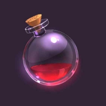|
|19|장비 아이템|교도관의 검|Jailer\_Sword|무기 아이템|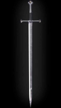|
|20|장비 아이템|범죄자의 방패|Criminal\_Shil ed|방패 아이템|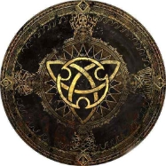|
|21|장비 아이템|수도원장의 모자|Abbot\_Hat|모자 아이템||
|22|장비 아이템|기사단 갑옷|Knight\_Arm or|의상 아이템|

기존  의상  Material  수정
|
|23|배경 요소|잔디|Grass|공용|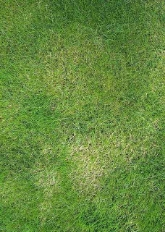|
|24|배경 요소|나무|Wood|공용||
|25|배경 요소|돌|Stone|공용|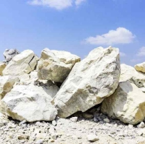|
|26|배경 요소|물|Water|공용||
|27|배경 요소|일반 집|House[numb er]|공용|![ref1]|
|28|배경 요소|가로등|Street lamp|공용|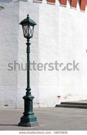|
|29|배경 요소|이정표|Milestone|공용||
|30|배경 요소|게시판|Notice board|공용|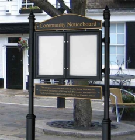|
|31|배경 요소|경비소 건물|Guarhouse\_ Building[nu mber]|맵 : 경비소||
|32|배경 요소|책상|Desk|공용||
|33|배경 요소|의자|Chair|공용||
|34|배경 요소|책|Book|공용||
|35|배경 요소|랜턴|Lantern|공용||
|36|배경 요소|펜|Pen|공용||
|37|배경 요소|편지|Letter|공용||
|38|배경 요소|울타리|Fence|공용||
|39|배경 요소|농장 건물|Farm\_Buildin g[number]|맵 : 농장|![ref1]|
|40|배경 요소|수레|Wagon|맵 : 농장||
|41|배경 요소|나무통|Wooden\_Bar rel|맵 : 농장|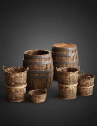|
|42|배경 요소|교도소 건물|Prison\_Buildi ng[number]|맵 : 교도소|![ref2]|
|43|배경 요소|철창|Iron\_Cage|맵 : 교도소|![ref2]|
|44|배경 요소|열쇠|Prison\_Key|맵 : 교도소|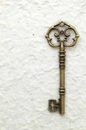|
|45|배경 요소|수도원 건물|Monastery\_B uilding[num ber]|맵 : 수도원|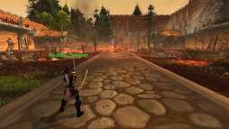|
|46|배경 요소|십자가|Cross|맵 : 수도원|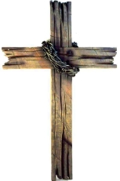|
|47|배경 요소|촛불|Candlelight|맵 : 수도원||
|48|배경 요소|성벽|Castle\_Ramp art|맵 : 성|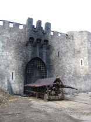|
|49|배경 요소|망루|Castle\_Watc hTower|맵 : 성|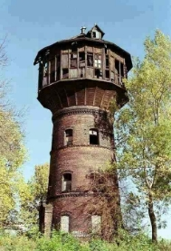|
|50|배경 요소|성문|Castle\_Gate|맵 : 성||
|51|배경 요소|사다리|Ladder|맵 : 성, 공용||
|52|배경 요소|도르레|Castle\_Pulley|맵 : 성|

사람이  탈  수  있는  이동장치
|
|53|배경 요소|깃발|Castle\_Flag|맵 : 성||
|54|UI|방위 표시|Compass|현재의 방위 표시||
|55|UI|미니맵|`  `Minimap|플레이어 중심으로 미니맵 표시||
|56|UI|체력 게이지 바|HP\_Bar|체력 게이지 표시||
|57|UI|장비 창|Equipment\_I nventory|현재 장착한 장비 표시||
|58|UI|아이템 창|Item\_Invent ory|보유한 장비 및 포션 확인 및 변경|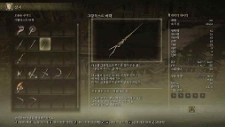|
|59|UI|재화 표시|Money\_UI|재화 표시||
|60|UI|타이틀 화면 이미지|Title\_Image|타이틀 화면|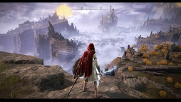|
|61|UI|게임 시작 버튼|GameStart\_B utton|타이틀 화면||
|62|UI|게임 종료 버튼|EndGame\_B utton|타이틀 화면, 메뉴에 존재||
|63|UI|메뉴 버튼|Menu\_Butto n|게임 재개, 종료 선택 가능||
|64|UI|지도|Map|전체 맵과 현재 위치 표시|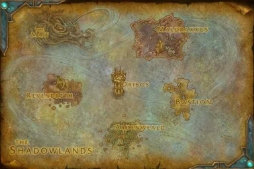|

2. 파라미터(속성)  뽑아  보기
1) 오브젝트  이름  :  Player

|**속성**|**영문명칭**|**설명**|**비고**|
| - | - | - | - |
|체력|Player\_HP|플레이어의  체력  수치||
|이동속도|Player\_Speed|플레이어의  이동속도||
|상태|Player\_Status|기본,  이동,  공격,  회피,  피격,  경직,  넘어짐,  사망  등의 상태||
|공격력|Player\_Attack \_Power|플레이어  공격력||
|방어력|Player\_Depens ive\_Power|플레이어  방어력||

2) 오브젝트  이름  :  몬스터  종류  전체

|**속성**|**영문명칭**|**설명**|**비고**|
| - | - | - | - |
|체력|[몬스터명]\_HP|플레이어의  체력  수치||
|이동속도|[몬스터명] \_Speed|플레이어의  이동속도||
|상태|[몬스터명] \_Status|기본,  이동,  공격,  회피,  피격,  경직,  넘어짐,  사망  등의 상태||
|공격력|[몬스터명] \_Attack\_Power|플레이어  공격력||
|방어력|[몬스터명] \_Depensive\_Po wer|플레이어  방어력||

3) 오브젝트  이름  :  경비대

|**속성**|**영문명칭**|**설명**|**비고**|
| - | - | - | - |
|일반|Guards\_Comm on|일반  경비대원,  경비소의  현상  수배로  인해  대부분의  캐 릭터  및  몬스터들이  플레이어를  적으로  간주함|맵  :  경비소|
|강화|Guards\_Enfor ce|강화된  경비대원,  일반  경비대원보다  기본  스탯이  높으며 특별한  공격  기술을  사용할  수  있음|맵  :  경비소|

4) 오브젝트  이름  :  농부

|**속성**|**영문명칭**|**설명**|**비고**|
| - | - | - | - |
|일반|Farmer\_Com mon|근접  공격을  할  수  있는  일반  농부|맵  :  농장|
|강화|Farmer\_Enfor ce|강화된  농부,  일반  농부보다  기본  스탯이  높으며  특별한 공격  기술을  사용할  수  있음|맵  :  농장|

5) 오브젝트  이름  :  교도관

|**속성**|**영문명칭**|**설명**|**비고**|
| - | - | - | - |
|일반|Jailer\_Commo n|원거리  공격을  할  수  있는  일반  교도관|맵  :  교도소|
|강화|Jailer\_Enforce|강화된  교도관,  일반  교도관보다  기본  스탯이  높으며  특 별한  공격  기술을  사용할  수  있음|맵  :  교도소|
|전리품|Jailer\_Sword|교도관이  허리춤에  차고  있던  검,  교도관을  처치할  시  일 정  확률로  드랍한다.|무기  아이템|

6) 오브젝트  이름  :  범죄자

|**속성**|**영문명칭**|**설명**|**비고**|
| - | - | - | - |
|일반|Criminal\_Com mon|근접  공격을  할  수  있는  일반  범죄자|맵  :  교도소, 전체|
|강화|Criminal\_Enfo rce|강화된  범죄자,  일반  범죄자보다  기본  스탯이  높으며  특 별한  공격  기술을  사용할  수  있음|맵  :  교도소, 전체|
|전리품|Criminal\_Shile d|범죄자가  지니고  있던  방패,  범죄자를  처치할  시  일정  확 률로  드랍한다.|방패  아이템|

7) 오브젝트  이름  :  이단자

|**속성**|**영문명칭**|**설명**|**비고**|
| - | - | - | - |
|일반|Heretic\_Comm on|근접  공격을  할  수  있는  일반  이단자|맵  :  수도원|
|강화|Heretic\_Enfor ce|강화된  이단자,  일반  이단자보다  기본  스탯이  높으며  특 별한  공격  기술을  사용할  수  있음|맵  :  수도원|

8) 오브젝트  이름  :  수도원장

|**속성**|**영문명칭**|**설명**|**비고**|
| - | - | - | - |
|보스|Abbot|맵  :  수도원의  보스  몬스터,  상당히  강하며  다양한  공격을 기술을  사용할  수  있음,  한  마리만  존재함|맵  :  수도원 中  보스맵|
|스킬|Abbot\_skill[nu mber]|다양한  범위  기술을  사용할  수  있음|맵  :  수도원 中  보스맵|
|전리품|Abbot\_Hat|수도원장이  지니고  있던  모자,  수도원장을  처치할  시  일 정  확률로  드랍한다.|모자  아이템|

9) 오브젝트  이름  :  기사

|**속성**|**영문명칭**|**설명**|**비고**|
| - | - | - | - |
|일반|Knight\_Comm on|근접  공격을  할  수  있는  일반  기사|맵  :  성|
|강화|Knight\_Enforc e|강화된  기사,  일반  기사보다  기본  스탯이  높으며  특별한 공격  기술을  사용할  수  있음|맵  :  성|
|전리품|Knight\_Armor|기사가  착용하고  있던  갑옷,  기사를  처치할  시  일정  확률 로  드랍한다.|의상  아이템|

10) 오브젝트  이름  :  궁병

|**속성**|**영문명칭**|**설명**|**비고**|
| - | - | - | - |
|일반|Archer\_Comm on|근접  공격을  할  수  있는  일반  궁병|맵  :  성|
|강화|Archer\_Enforc e|강화된  궁병,  일반  궁병보다  기본  스탯이  높으며  특별한 공격  기술을  사용할  수  있음|맵  :  성|

11) 오브젝트  이름  :  벨페고르

|**속성**|**영문명칭**|**설명**|**비고**|
| - | - | - | - |
|보스|Belphegor|맵  :  성의  보스  몬스터,  상당히  강하며  다양한  공격을  기 술을  사용할  수  있음,  한  마리만  존재함|맵  :  성  中 보스맵|
|스킬|Belphegor\_skil l[number]|다양한  범위  기술을  사용할  수  있음|맵  :  성  中 보스맵|

12) 오브젝트  이름  :  체력  물약

|**속성**|**영문명칭**|**설명**|**비고**|
| - | - | - | - |
|회복량|HP\_Potion\_He aling|체력  회복  수치||
|개수|HP\_Potion\_Co unt|체력  물약  개수||

13) 오브젝트  이름  :  배경

|**속성**|**영문명칭**|**설명**|**비고**|
| - | - | - | - |
|마을|Town|플레이어가  모험을  시작하는  곳,  마을을  중심으로  곳곳의 필드로  나아갈  수  있다.  대부분  플레이어와  우호적인  관 계를  지닌  NPC들로  구성되어있다.|평화로움|
|경비소|Guards\_Office|플레이어의  현상수배를  공지한  곳이며  국가  직속  경비소 이다.  곳곳에  초소가  존재하고  삼엄한  경비  태세를  유지 한다.  아무  잘못도  하지  않은  플레이어에게  누명을  씌우 며  경비대의  역할을  제대로  수행하지  않는  듯한  느낌을 준다.|긴장되는  분 위기|
|농장|Farm|한적한  농장이며,  사회적으로  일을  안  하고  놀고만  있는 농부들로  인해  식량난이  일어난  상태이며  플레이어가  농 부들과의  전투를  통해  농부들을  다시  일하게  시키는  이벤 트가  있는  곳이다.|평 화 로 움 과 분주함이  공 존하는  분위 기|
|교도소|Jail|험악하고  어두운  분위기,  범죄자들을  관리하지  않는  교도 관들과  그에  따라  맵  곳곳에  돌아다니는  범죄자들로  인해 국가가  어지러운  상태에  처해있다.|험악하고  어 두운  분위기|
|수도원|Abbey|이단자들이 도사리는 수도원, 수도원장을 물리치고 현 사태를 완화시켜야 한다.|음산한 분위기|
|성|Castle|먼 과거부터 명예를 중시한 왕국의 성, 현재는 악마 벨페고르가 왕을 죽이고 군림하여 세계 전체에 어두운 기운을 퍼뜨렸다.|고귀함과 어두움의 공존|

3. 행동  뽑아  보기

\1)  오브젝트  이름  :  Player,  몬스터  종류  전체(몬스터는  키  입력  요소  배제)

|**행동**|**영문명칭**|**설명**|
| - | - | - |
|기본|Idle|가만히  있을  때  Idle  모션이  출력된다.|
|전진|Front|W키를  눌러서  앞으로  이동한다.|
|후진|Back|S키를  눌러서  뒤로  이동한다.|
|좌측  이동|Left|A키를  눌러서  좌측으로  이동한다.|
|우측  이동|Right|D키를  눌러서  우측으로  이동한다.|
|회피(구르기)|Avoid|스페이스  바를  눌러서  입력한  키의  방향대로 구른다(공격  면역  상태)|
|공격|Attack|마우스  좌측  클릭을  통해  공격한다.  모션은  기 본  공격  중  랜덤하게  발동한다.|
|스킬  공격|Skill\_Attack|마우스  우측  클릭을  통해  스킬  공격을  가한다.|
|피격(경직)|Heated|맞았을  시  몸이  경직  잠시동안  경직된다.|
|넘어짐|Trip|강력한  공격을  받았을  시  잠시  동안  넘어진다.|
|사망|Dead|체력  게이지가  다  닳았을  때  사망  모션이  출 력되며  게임이  종료된다.|

4. 상태  뽑아  보기

\1)  오브젝트  이름  :  Player,  몬스터  종류  전체(몬스터는  키  입력  요소  배제)

<table><tr><th colspan="1"><b>현상태</b></th><th colspan="1"><b>전이상태</b></th><th colspan="1"><b>전이조건</b></th></tr>
<tr><td colspan="2">기본</td><td colspan="1">가만히  있을  때  Idle  모션이  출력된다.</td></tr>
<tr><td colspan="1" rowspan="10">기본</td><td colspan="1">전진</td><td colspan="1">W키를  눌러서  앞으로  이동한다.</td></tr>
<tr><td colspan="1">후진</td><td colspan="1">S키를  눌러서  뒤로  이동한다.</td></tr>
<tr><td colspan="1">좌측  이동</td><td colspan="1">A키를  눌러서  좌측으로  이동한다.</td></tr>
<tr><td colspan="1">우측  이동</td><td colspan="1">D키를  눌러서  우측으로  이동한다.</td></tr>
<tr><td colspan="1">회피(구르기)</td><td colspan="1">스페이스  바를  눌러서  입력한  키의  방향대로  구른 다(공격  면역  상태)</td></tr>
<tr><td colspan="1">공격</td><td colspan="1">마우스  좌측  클릭을  통해  공격한다.  모션은  기본 공격  중  랜덤하게  발동한다.</td></tr>
<tr><td colspan="1">스킬  공격</td><td colspan="1">마우스  우측  클릭을  통해  스킬  공격을  가한다.</td></tr>
<tr><td colspan="1">피격(경직)</td><td colspan="1">맞았을  시  몸이  경직  잠시동안  경직된다.</td></tr>
<tr><td colspan="1">넘어짐</td><td colspan="1">강력한  공격을  받았을  시  잠시  동안  넘어진다.</td></tr>
<tr><td colspan="1">사망</td><td colspan="1">체력  게이지가  다  닳았을  때  사망  모션이  출력되 며  게임이  종료된다.</td></tr>
<tr><td colspan="1">
전진

후진

좌측  이동 우측  이동
</td><td colspan="1">
전진

후진

좌측  이동 우측  이동
</td><td colspan="1">먼저  입력  된  키  2개의  방향으로  이동이  가능하 며,  3개  이상  눌렀을  시  가장  먼저  입력된  키를 제외한  2개의  키에  해당하는  방향으로  이동한다.</td></tr>
<tr><td colspan="1">
전진

후진

좌측  이동 우측  이동
</td><td colspan="1">회피(구르기)</td><td colspan="1">스페이스  바  키를  눌러서  이동하는  방향으로  구르 기를  시전한다.</td></tr>
<tr><td colspan="1">
공격

스킬  공격
</td><td colspan="1">피격(경직) 넘어짐 사망</td><td colspan="1">마우스  클릭을  통한  공격을  실행했을  때  공격이 적에게  닿은  이후  플레이어  본인이  공격을  맞아서 피격,  넘어짐,  사망에  이르렀을  때  데미지  계산은 완료된  상태이며,  공격이  닿기  전에  입력  후  위  3 가지  상태로  전환될  때  데미지는  들어가지  않는 다.</td></tr>
<tr><td colspan="1">넘어짐</td><td colspan="1">사망</td><td colspan="1">넘어진  상태에서  사망하게  된다면  그에  해당하는 죽는  모션이  출력된다.</td></tr>
</table>

5\.  플레이어  캐릭터  속성(파라미터)

|**속성**|**영문명칭**|**설명**|**비고**|
| - | - | - | - |
|교도관의  검|Jailer\_Sword|기본  무기보다  공격력이  더  높아서,  공격  시  데미지가  높 아진다.|데미지  증가|
|범죄자의  방패|Criminal\_Shile d|기본  방패보다  방어도가  높아서  피격  시  데미지가  감소한 다.|데미지  감소|
|수도원장  모자|Abbot\_Hat|착용  시에  최대  체력이  증가한다.|최대  체력  증 가|
|기사단  갑옷|Knight\_Armor|착용  시에  방어도가  증가하여  피격  데미지가  감소한다.|데미지  감소|

6. 게임의  규칙
1) 핵심  규칙
   1. 플레이어는  현재  상태를  잘  파악하여  체력  게이지  바가  다  닳아  게임  오버가  되지  않도록  해야한다.
   1. 전투나  퀘스트를  통해  얻은  게임  내  재화를  이용하여  캐릭터를  성장시켜야  한다.
   1. 플레이어는  준비된  스토리에  따라  모험하며  최종  보스  몬스터와의  전투에서  승리하여  게임을  클리어한다.

2) 보조  규칙
- 몬스터의  공격을  회피기로  피할  수  있고,  적절한  공격  타이밍에 전투에서  유리한  상황을  취할  수  있다.
- 각  몬스터는  다양한  공격  패턴이  있기  때문에  다양한  방식으로 

7\.  게임에서  사용될  공식

- 장비  착용에  따른  데미지  계산  변화
- 스킬  공격  사용  이후  재사용  대기  시간  계산  및  조건부  재사용  대기  시간  부여
- 방향  전환  시  이동속도  변화  기능

[ref1]: docs/Aspose.Words.c732007b-06de-455a-890c-dd562bc3a9ca.027.jpeg
[ref2]: docs/Aspose.Words.c732007b-06de-455a-890c-dd562bc3a9ca.040.jpeg

